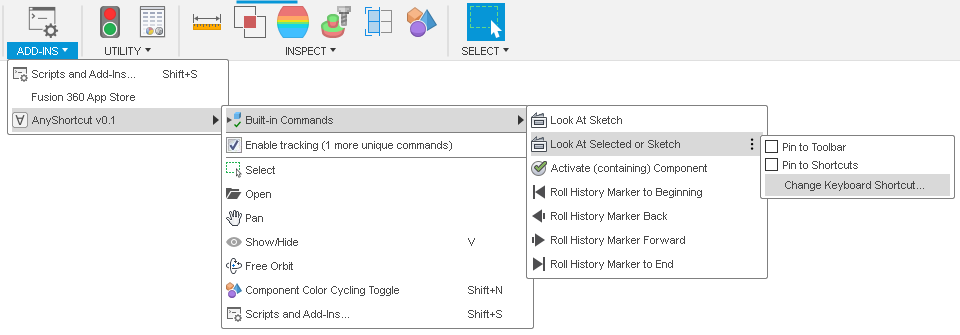

# AnyShortcut

A Fusion 360 add-in for easily assigning keyboard shortcuts to many* commands.

When enabled, the add-in tracks the resulting commands of actions that the user performs and collects them in a menu. The commands in the menu can be assigned shortcut keys in the regular way.

\* Not all actions result in "Commands" in Fusion 360 and some commands are not usable on their own. Typical commands act on the Design space in some way. For example, *Find in Browser* and *Isolate* can be mapped, while *Pick Circle/Arc Tanget* does not generate a "Command" and *Roll History Marker Here* is a command, but it would need input on where to move the marker, which can not be provided (However, moving the history marker can be done by a script or add-in).

## Installation
Download the add-in from the [Releases](https://github.com/thomasa88/AnyShortcut/releases) page.

Unpack it into `API\AddIns` (see [How to install an add-in or script in Fusion 360](https://knowledge.autodesk.com/support/fusion-360/troubleshooting/caas/sfdcarticles/sfdcarticles/How-to-install-an-ADD-IN-and-Script-in-Fusion-360.html)).

Make sure the directory is named `AnyShortcut`, with no suffix.

## Usage

Press Shift+S in Fusion 360 and go to the *Add-Ins* tab. Then select the add-in and click the *Run* button. Optionally select *Run on Startup*.

The new menu *TOOLS* -> *ADD-INS* -> *Any Shortcut* is now available.

To set up a shortcut:

* Click *Enable tracking* and then perform the command you want to create a shortcut for
* If you are lucky, the command will now have appeared in the menu.
* Find the command in the menu and click the three dots to assign a shortcut as usual.

To remove a shortcut, follow the same procedure. Hint: You can press the shortcut to trigger the command to be run.

## Some Commands to map

Here is a table of some commands that can be interesting to map, including a suggested key.

| Key  | Command                  | Notes                                                        |
| ---- | ------------------------ | ------------------------------------------------------------ |
| F2   | Rename, in the timeline  | Let's you select an item in the timeline and press F2 to rename it. I have not found any way to do this in the browser. |
|      | Look at (bottom toolbar) | Select a face and orient the view normal to it. I have not found any way to tell it to "Look at" the current. |
|      | Isolate                  |                                                              |
|      | Find in Browser          |                                                              |
|      | Find in Window           |                                                              |
|      | Activate Component       | Works in the Browser and in the 3D space, but you must have selected a component in 3D space, not a body or a face. |

## Finding out what keys you have mapped

See [KeyboardShortcutsSimple](https://github.com/thomasa88/KeyboardShortcutsSimple/blob/master/README.md).