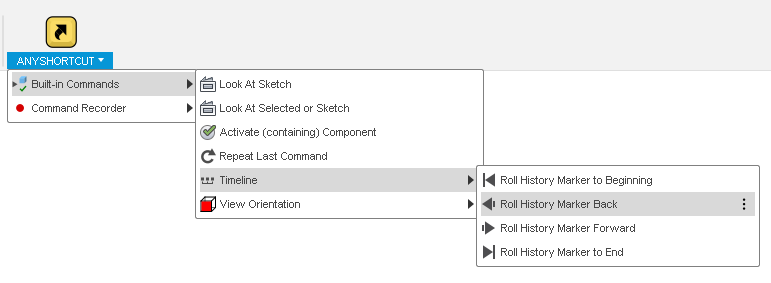
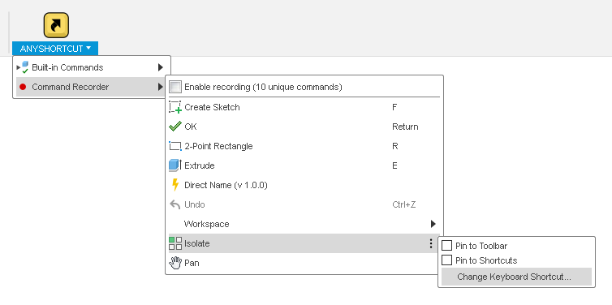

# AnyShortcut

AnyShortcut is a Fusion 360 add-in for easily assigning keyboard shortcuts to commands where it is not usually possible to assign a shortcut*. It also has some built-in commands for Fusion 360 commands that cannot easily be capture and run without some extra tweaking (e.g. *Look At Sketch*).

If you get any problems, please check out the section on [Fusion 360 quirks](#fusion-360-quirks).

## Built-in Commands

The built-in commands are always visible in the *AnyShortcut* menu. Assign shortcuts to them in the usual way.

Built-in commands include:

 * Look At Sketch
 * Look At Selected or Sketch
 * Activate (containing) Component
 * Move history marker backwards/forwards
 * View orientation
 * Repeat last command

## Tracking

When enabled, the add-in tracks the resulting commands of actions that the user performs and collects them in the *AnyShortcut* menu. The commands in the menu can then be assigned shortcut keys in the regular way.

If not stopped, the tracking stops automatically after a number of commands, to avoid any performance degradation when the user is not setting up shortcuts.

\* Not all actions in Fusion 360 result in "Commands" and some commands are not usable on their own. For example, *Pick Circle/Arc Tangent* does not generate a "Command" and *Roll History Marker Here* is triggered when clicking rewind in the history, but rewind actually first selects an item and then rolls.

### Usage

To set up a shortcut:

* Click *Enable tracking* and then perform the command you want to create a shortcut for
* If you are lucky, the command will now have appeared at the bottom of the *AnyShortcut* menu.
* Find the command in the menu and click the three dots to assign a shortcut as usual.

To remove a shortcut, follow the same procedure. Hint: You can press the shortcut to trigger the command to be run.

## Fusion 360 Quirks

Be aware of the following quirks in Fusion 360.

* Even though you've added a shortcut, it might not show up next time you restart Fusion 360. However, the shortcut still works and you see it if you open *Change Keyboard Shortcut*. (You can also verify using [KeyboardShortcutsSimple](https://github.com/thomasa88/KeyboardShortcutsSimple/blob/master/README.md))

* Fusion cannot handle all key combinations. Forget Alt+Left to rollback history, because Fusion 360 cannot save this combination and it will be broken next time you start Fusion 360.

* Menu items in sub-menus are not always clickable ([bug](https://forums.autodesk.com/t5/fusion-360-api-and-scripts/api-bug-cannot-click-menu-items-in-nested-dropdown/td-p/9669144)). However, you don't need to be able to click the commands to map a shortcut!

## Installation

Download the add-in from the [Releases](https://github.com/thomasa88/AnyShortcut/releases) page.

Unpack it into `API\AddIns` (see [How to install an add-in or script in Fusion 360](https://knowledge.autodesk.com/support/fusion-360/troubleshooting/caas/sfdcarticles/sfdcarticles/How-to-install-an-ADD-IN-and-Script-in-Fusion-360.html)).

Make sure the directory is named `AnyShortcut`, with no suffix.

Press Shift+S in Fusion 360 and go to the *Add-Ins* tab. Then select the add-in and click the *Run* button. Optionally select *Run on Startup* (This is needed if you want the *AnyShortcut* built-in commands to function after restarting Fusion 360).

The new menu *TOOLS* -> *ADD-INS* -> *AnyShortcut* is now available.

## Ideas for commands to map

Here is a table of some commands that can be interesting to map.

| Command                  | Notes                                                        |
| ------------------------ | ------------------------------------------------------------ |
| Rename, in the timeline  | Let's you select an item in the timeline and press F2 to rename it. I have not found any way to do this in the browser. |
| Look at (bottom toolbar) | Select a face and orient the view normal to it. I have not found any way to tell it to "Look at" the current. |
| Isolate                  |                                                              |
| Find in Browser          |                                                              |
| Find in Window           |                                                              |
| Activate Component       | Works in the Browser and in the 3D space, but you must have selected a component in 3D space, not a body or a face. |
| Remove                   | Opposed to *Delete,* *Remove* appears as a timeline feature. |

## Finding out what keys you have mapped

See [KeyboardShortcutsSimple](https://github.com/thomasa88/KeyboardShortcutsSimple/blob/master/README.md).

## Changelog

* v 0.4.0
  * Restructured menus
  * Repeat last command
* v 0.3.0
  * View orientation commands
  * Fusion quirks info

